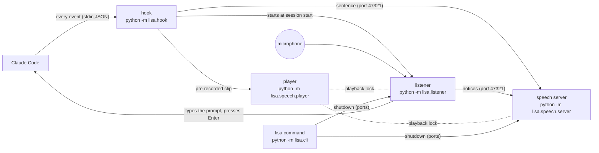

# How Lisa works

Lisa is three kinds of process that talk over local ports, plus one shared file lock for the speaker.



| Process        | Lives                                   | Job                                                        |
|----------------|-----------------------------------------|------------------------------------------------------------|
| hook           | ~50 ms per Claude Code event            | decide what to say; never slow down or break Claude Code   |
| player         | while one clip plays                    | play a pre-recorded clip, queued behind other Lisa audio   |
| speech server  | on demand, exits after `server.idle_minutes` | keep the voice model loaded, speak sentences live     |
| listener       | while Claude Code is open               | hear "Lisa, …", type the prompt, confirm and send          |

## Code map

```
lisa/
├── paths.py, config.py, state.py, log.py, system.py, download.py   shared basics
├── cli.py, install.py        the `lisa` command; install/uninstall
├── hook/                     Claude Code hook (standard library only)
│   ├── __main__.py           event → clip, live sentence, reply summary
│   ├── transcript.py         reads the turn from the transcript: final reply, what kind of task it was
│   └── loading_words.py      optional loading-word sync via Claude's spinnerVerbs setting
├── text/                     describe.py (tool call → sentence), summarize.py (reply → first paragraph)
├── speech/                   engines.py, generate.py, clips.py, player.py, client.py, server.py
└── listener/                 listener.py (the loop and prompt flow), language.py (word rules), vad.py,
                              stt.py, voiceprint.py, sounds.py, desktop.py (focus, typing, clipboard)
```

## Design points

**The hook must be cheap and harmless.** Claude Code waits for it on every tool call. So `lisa.hook` and
everything it imports (`text`, `speech.clips`, `speech.client`, `state`, `system`, `config`) use only the
standard library; anything heavy runs in a detached process (`system.spawn`); every reaction is wrapped so an
error is logged to `.lisa/logs/hook.log` and the hook still exits 0.

**Pre-recorded vs. live speech.** Fixed lines (greetings, "The changes are complete", "Yes, sir?") are
rendered once into `audio/<category>/` by `lisa generate` and play instantly. Sentences that depend on what
Claude does (tool descriptions, reply summaries) go to the speech server, which keeps the model loaded,
speaks one sentence at a time and drops sentences that waited longer than `server.max_delay_seconds`
(replies may wait `reply.max_delay_seconds`). A new prompt sends `{"cancel": "response"}` so an old reply
stops being read.

**One process per job, found by port.** The server and the listener bind a fixed local port; a second copy
fails to bind and exits, so the port is the single-instance lock. `system.send_message` sends one JSON
message per connection (`shutdown`, `cancel`, a sentence, or `ping` to check it runs).

**No overlapping audio.** Every sound, from any process, is played while holding the byte lock on
`.lisa/playback.lock` (`speech.player.playback_lock`). The listener checks the same lock to ignore the
microphone while Lisa talks, plus 0.8 s for the echo.

**On/off state.** `.lisa/state.json` holds `enabled` and `listening`. The hook returns before reading
its input when `enabled` is false; the listener re-checks both every 2 s, so it stops even if a shutdown
message is missed.

**Reading the reply.** On `Stop`, `transcript.final_reply` takes Claude's last message (re-reading the
transcript for up to 1.5 s, because the hook can fire before it is written) and `summarize_reply` turns the
Markdown into plain sentences: code blocks, tables and headings are skipped, file paths become file names,
a list counts as its own paragraph.

**The listener pipeline** (`listener.Listener`):
1. The microphone delivers 80 ms chunks. The voice-activity detector (`vad.py`) groups them into sentences
   ended by `listener.silence_seconds` of silence, keeping ~0.5 s before the speech so no word is clipped.
2. With `voice_check` on and a voiceprint enrolled, the sentence's speaker embedding is compared with yours
   (~50 ms). Other voices stop here, before any transcription.
3. The quick model (`speech_to_text.quick_model`) transcribes it; `language.match_wake` checks for the name
   at the start. Anything else is dropped without logging.
4. A voice command ("off"), a cancel ("never mind") or the prompt is handled. Prompts are transcribed again
   with the accurate model, typed with `SendInput` Unicode key presses, and then `confirm_and_send` asks
   "Shall I send it?". The answer is transcribed by `speech_to_text.answer_model` with a short hint of the
   expected words, capped at 16 tokens so the hint can't make Whisper loop. A yes presses Enter and a no
   erases the typed text, both only in the same window; "keep it", silence or an unclear answer leave the
   text for you. The next prompt erases that leftover
   text first, unless `desktop.KeyWatcher` (a low-level keyboard hook, active only while text is left)
   saw you type or press Enter since; Lisa's own keys are injected and not counted.

**When it listens.** Only while Lisa and the microphone are on, a Claude Code process runs (`claude.exe`,
not the desktop app, see `system.claude_code_running`) and, unless `listener.enabled_on_battery`, the
laptop is plugged in. Otherwise the microphone is released.

**Loading-word sync** (off by default). Claude Code picks its spinner word when a turn starts and hooks
can't see it, so after each turn Lisa picks the next word, writes it as the only `spinnerVerbs` entry in
Claude's settings and plays it on your next prompt. Settings are parsed before writing, so a broken
settings file is never overwritten, and `lisa off` only removes `spinnerVerbs` that Lisa set.

## Where things are stored

| Path                  | What                                                     | In git |
|-----------------------|----------------------------------------------------------|--------|
| `config.default.json` | every setting and its default                            | yes    |
| `config.json`         | your overrides                                           | no     |
| `phrases.json`, `loading_words.json` | Lisa's lines, Claude Code's loading words | yes    |
| `audio/`              | generated clips                                          | no     |
| `models/`             | downloaded models (Kokoro, Piper, Whisper, VAD, speaker) | no     |
| `.lisa/`              | state, voiceprint, playback lock, logs                   | no     |

## Testing

`pytest` covers everything that is plain logic: the word rules, reply summaries, tool descriptions,
transcript classification, config merging and the settings file editing used by `lisa install`.

The audio path can be exercised without a microphone by generating speech with the voice engine:

```python
import numpy as np
from scipy.signal import resample_poly  # or any resampler
from lisa.config import load_config
from lisa.speech.engines import create_engine
from lisa.listener import listener as L

config = load_config(); config["listener"]["port"] = 47399  # don't collide with a running listener
pcm, rate = create_engine(config).synthesize("af_bella", "Lisa, list the files.")
audio = resample_poly(np.frombuffer(pcm, np.int16).astype(np.float32), 16000, rate).astype(np.int16)
audio = np.concatenate([audio, np.zeros(16000 * 2, np.int16)])  # a pause ends the sentence

listener = L.Listener(config); listener.load_models()
listener.say = lambda *args: None                    # no sound, and keep queued audio
listener.deliver = lambda text: print("typed:", text)
for i in range(0, len(audio) - L.CHUNK, L.CHUNK):
    listener.collect_sentence(audio[i:i + L.CHUNK])
```

Kokoro's voices all sound alike to the speaker model, so a synthetic "other person" needs a raised
`voice_check.threshold` to be rejected.
